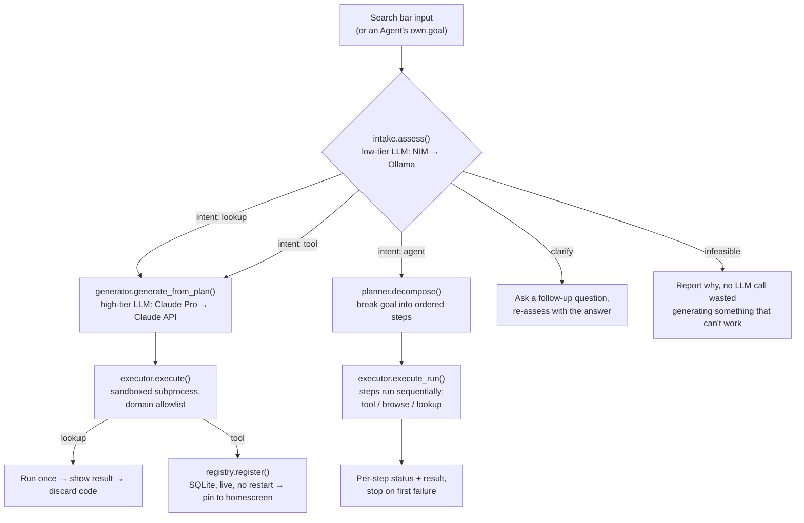
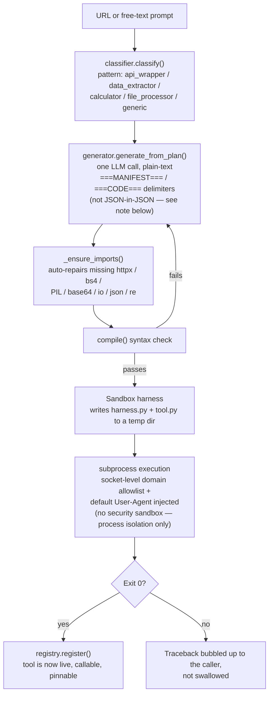

# Atlas

**The internet as a personal tool.** Not a browser you use — a platform that wields the internet for you.

One search bar. Ask a question, build a tool, generate media, kick off a multi-step agent, or browse privately — all from the same input, running local-first, backed by whichever AI model actually makes sense for the job.


> A single input surface for search, tool creation, agent execution, and media generation — the interface adapts to the request rather than requiring a different tool for each task.

---

## Overview

Most "AI browser" products bolt a chat window onto an existing browser, or add a chatbot sidebar to search results. Atlas takes a different approach: the search bar is the entire interface. Tool creation, agent execution, memory, and media generation are all reachable from that single input, routed automatically to the right subsystem.

It is also **local-first by design**. Low-complexity work — classification, feasibility checks, embeddings — runs on-device via Ollama. Requests that genuinely require a frontier model escalate to the cloud, and even then a free Claude Pro subscription is tried before any paid API credits are spent.

---

## Features

### Search that builds what it needs
Each request is classified per-call to determine the appropriate execution path:
- **Direct lookup** ("who is Elon Musk") — generates a one-off Python tool, executes it, renders a structured result card (image, key facts, related topics), then discards the code.
- **Reusable tool** ("build me a JPG to PNG converter") — generates and persists a tool with a real input form, available from the homescreen on subsequent use.
- **Multi-step goal** ("check the weather in London and save it to memory") — routed to the agent planner rather than forced into a single-tool response.


### Tool Builder
A URL or a natural-language description is classified, then an LLM generates a manifest and a Python implementation, which is registered live with no restart or deploy step required. Every generated tool executes in a sandboxed subprocess constrained by a socket-level domain allowlist, restricting network access to the domains declared at generation time.


Pinned tools are accessible from a slide-up panel at the bottom of the screen. Selecting one opens its input form in a modal, rather than re-executing with default values.


### Agents
Goals are decomposed into an ordered sequence of steps — run a saved tool, browse a URL, or perform a one-off lookup — executed sequentially with per-step status reporting on failure. Recurring goals can be scheduled at a fixed interval or daily time and run unattended.


### Memory
Lookups, tool executions, and page visits are stored automatically in a two-tier memory system (SQLite plus a ChromaDB semantic layer). User preferences are periodically inferred from usage patterns and injected into tool-generation prompts without requiring repeated context.

### Privacy & Safety
- Tor proxy and fingerprint randomization for anonymous browsing, enabled per request (`tor=True` / `stealth=True`)
- Safe browsing verification (Google Safe Browsing, VirusTotal, and local phishing heuristics) capable of blocking a request before a dangerous URL is fetched
- All privacy and safety behaviors default to **off**; defaults are configured centrally in Settings

### Settings & Diagnostics
A single panel consolidates configuration that previously lived in environment variables: model-routing preference, Tor/stealth/safe-browsing defaults, memory and usage-log management, links to each provider's console, and live GPU/VRAM and provider-availability diagnostics.


### Developer Mode
An internal toggle exposes a model picker (for forcing a specific provider/model per request during testing), a live cost/usage tracker, and a raw request log. None of this is visible in standard use.


---

## Architecture

### Request flow



### Tool Builder — how a page or a sentence becomes running code



The tool builder doesn't edit *its own* source — it writes brand-new, throwaway or saved Python files per request. Nothing it generates can modify Atlas's own backend/frontend code; the sandbox's domain allowlist and subprocess isolation exist specifically so generated code can't reach outside the one job it was written for.

> **Why plain-text delimiters instead of JSON?** An earlier version had the LLM return `{"manifest": {...}, "code": "..."}` as one JSON blob, with the Python source embedded as a JSON string value. Weaker local models routinely broke this — unescaped backslashes/quotes inside the embedded code corrupted the JSON. Switching to `===MANIFEST===` / `===CODE===` plain-text sections removed the entire bug class instead of patching individual escape failures.

### Project structure

```
atlas/
├── backend/
│   ├── app/
│   │   ├── models/        # Phase 1 — router.py + one client per provider
│   │   │   ├── router.py
│   │   │   ├── ollama_client.py
│   │   │   ├── nim_client.py
│   │   │   ├── claude_api_client.py
│   │   │   ├── claude_oauth_client.py
│   │   │   └── usage_log.py
│   │   ├── browser/        # Phase 2 — Playwright engine
│   │   ├── search/         # Phase 3 — ChromaDB + BM25
│   │   ├── media/          # Phase 4 — FLUX/GPT Image/Ideogram/RunwayML/ElevenLabs
│   │   ├── ide/             # Phase 5 — sandbox runner, git ops, AI completion
│   │   ├── privacy/        # Phase 6 — Tor proxy, fingerprint spoofing
│   │   ├── safety/          # Phase 7 — Safe Browsing, VirusTotal, heuristics
│   │   ├── toolbuilder/    # Phase 8 — classifier, generator, executor, registry
│   │   ├── memory/         # Phase 9 — SQLite + ChromaDB two-tier store
│   │   ├── agents/          # Phase 10 — store, planner, executor, scheduler
│   │   ├── dev/              # Dev-mode: settings_store, diagnostics, activity_log
│   │   └── api/               # FastAPI routes + Pydantic schemas
│   └── venv/
├── frontend/
│   └── src/
│       ├── App.jsx            # Shell: nav state, dev-mode toggle, overlay coordination
│       ├── pages/            # HomePage, ToolBuilderPage, AgentsPage, BrowserPage
│       └── components/     # Notch, ScriptsPanel, SettingsPanel, UsageWidget, ToolPanel
├── data/                       # usage_log.jsonl, settings.json, memory.db, agents.db
├── docs/                       # This README + screenshots
└── start.bat                  # One-click launcher (backend + frontend)
```

## APIs & models

Atlas doesn't lock you into one model provider — it routes between them based on task complexity, and prefers free/local whenever the task allows it.

### Routing tiers

| Tier | Provider (in fallback order) | Used for |
|---|---|---|
| Embeddings | Ollama (`nomic-embed-text`, local) | Semantic memory search |
| Low complexity | NVIDIA NIM &rarr; Ollama (`llama3.1:8b`) | Feasibility checks, classification, intent detection |
| High complexity | Claude Pro (OAuth, free) &rarr; Claude API | Tool/code generation, goal decomposition |

### Every model currently wired up (dev-mode model picker)

| Provider | Models |
|---|---|
| Ollama (local) | `llama3.1:8b` (default), `qwen3.5:9b` (opt-in — defaults into a thinking-mode spiral, not used as a router default) |
| NVIDIA NIM | `meta/llama-3.3-70b-instruct` |
| Claude API | `claude-haiku-4-5`, `claude-sonnet-4-6` |
| Claude Pro (OAuth) | `claude-oauth` (routes to whatever model the Pro subscription serves via Claude Code) |

### Other API integrations

All optional, all degrade gracefully with no key configured:

| Category | Provider | Notes |
|---|---|---|
| Image generation | FLUX (local, via ComfyUI) | Runs entirely on-device, no API cost |
| Image generation | GPT Image (OpenAI) | Cloud, replaces an earlier DALL-E 3 integration after OpenAI deprecated it |
| Image generation | Ideogram | Cloud |
| Video generation | RunwayML (`gen4_turbo`) | Cloud |
| Voice | ElevenLabs (TTS) | Cloud |
| Browsing | Playwright (headless Chromium) | JS-rendered pages, form fill/extract, screenshots |
| Privacy | Tor (SOCKS5 proxy) | Opt-in per request, off by default |
| Safety | Google Safe Browsing v4 | Falls back to local heuristics with no key |
| Safety | VirusTotal v3 | Falls back to local heuristics with no key |
| Reference data | Wikipedia REST API (`summary`, `media-list`, `search/page`) | Used *inside* generated lookup tools, not by Atlas's own backend directly |

Generated tools themselves are restricted to `httpx`, `beautifulsoup4`, and Pillow — nothing else is importable from inside sandboxed code, regardless of what the model tries to write.


---

## Distribution Roadmap

Atlas currently runs as a local FastAPI + React application. The final phase of the roadmap addresses packaging and distribution:

- Windows installer with Start Menu integration (an initial version — a launch script plus a shortcut installer — is already in place)
- Docker support for non-Windows and server deployments
- A setup wizard for API key configuration and model preferences
- Public release, contingent on a security review of the tool-builder sandbox — the current implementation provides process isolation and a network domain allowlist, not a hardened security boundary, and should not execute untrusted generated code outside a single-developer context until that review is complete

A standalone browser shell — Atlas as the browser itself, rather than a tool that drives Playwright — is under consideration as a longer-term direction and is not yet scoped.

---

## Project Status

In active development. Ten of eleven roadmap phases are complete — model routing, browser engine, memory, media generation, code sandbox, privacy layer, safe browsing, tool builder, agent loop, and UI shell — with packaging and distribution as the remaining milestone.

---

## Planned: command shortcuts (not yet live)

An earlier UI pass added prefix commands to the search bar for jumping straight to a subsystem:

| Prefix | Target |
|---|---|
| `~` | Tool Builder |
| `#` | Memory |
| `*` | Run a saved tool |
| `/` | Browser |
| `>` | Code IDE |

These were pulled out when the AI intent pipeline (lookup/tool/agent detection) took over routing search-bar input — right now typing `~something` is just treated as ordinary search text, not a shortcut. Listed here as a planned re-add, not a current feature.
