# Atlas

**The internet as a personal tool.** Not a browser you use — a platform that wields the internet for you.

One search bar. Ask a question, build a tool, generate media, kick off a multi-step agent, or browse privately — all from the same input, running local-first, backed by whichever AI model actually makes sense for the job.

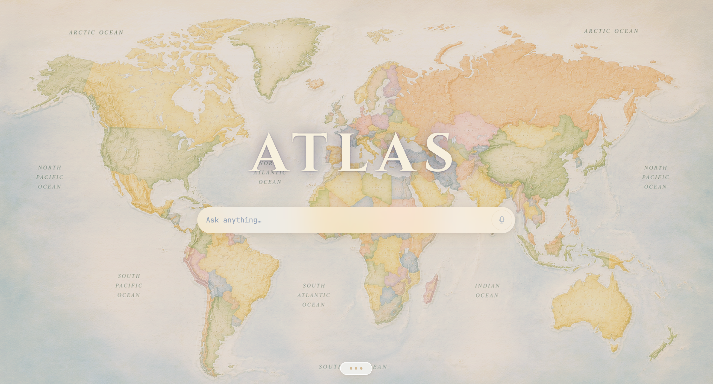

> The Steve Jobs moment for the internet. One bar. Type what you want. Done.

---

## Why

Every "AI browser" so far is a chat window bolted onto a browser, or a browser with a chatbot sidebar. Atlas inverts that: the search bar *is* the interface, and everything else — tool creation, agents, memory, media — is something that bar can reach into on demand, without you ever having to know which subsystem is doing the work.

It's also **local-first by default**. Cheap, low-complexity work (classification, feasibility checks, embeddings) runs on your own GPU via Ollama. Only the parts that genuinely need a frontier model escalate to the cloud, and even then it tries your free Claude Pro subscription before spending API credits.

---

## What it can do today

### 🔍 Search that builds what it needs
Type a question and Atlas decides, per-request, what kind of answer it needs:
- **A direct lookup** ("who is Elon Musk") → generates a one-off Python tool on the spot, runs it, shows you a result card (with an image, key facts, related topics — Spotlight-style, not a wall of text), then throws the code away.
- **A reusable tool** ("build me a JPG to PNG converter") → generates and *saves* a tool with a real input form, pinned to your homescreen for next time.
- **A multi-step goal** ("check the weather in London and save it to memory") → detected automatically and handed to the agent planner instead of trying to force it into a single tool.

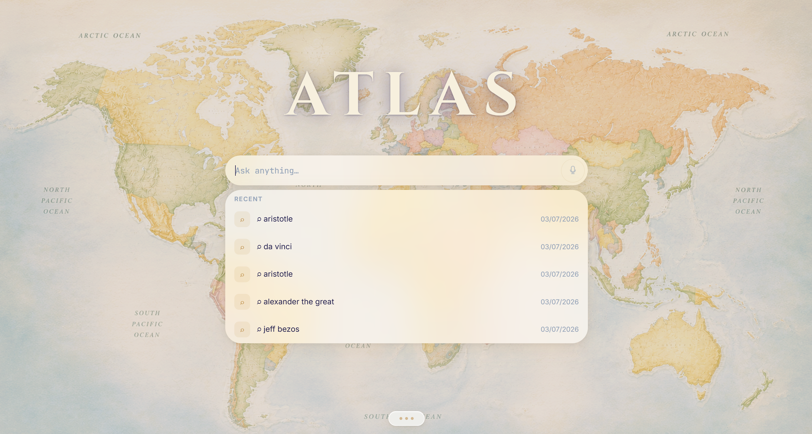

### 🛠️ Tool Builder — the core idea
Paste a URL or describe what you want, and an LLM classifies the page/request, writes a manifest + Python implementation, and registers it live — no restart, no deploy step. Every generated tool runs in a sandboxed subprocess with a socket-level domain allowlist (it can only talk to the domains it declared upfront).

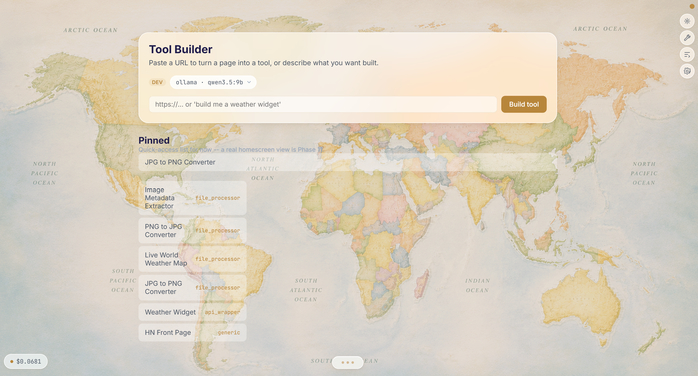

Pinned tools live in a slide-up "Notch" at the bottom of the screen. Tapping one opens a real input form in a modal — not a blind re-run with default values.

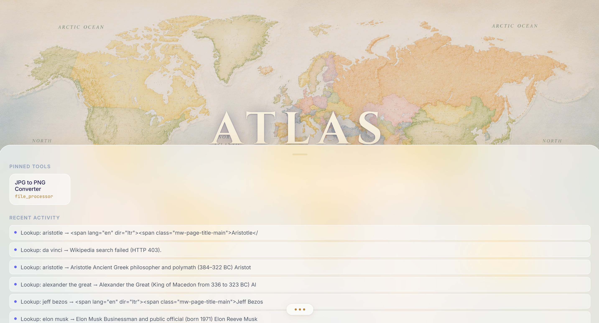
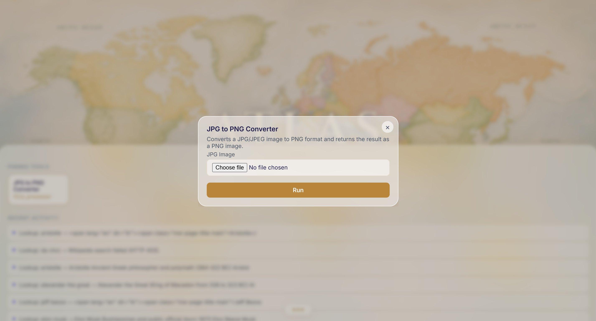

### 🤖 Agents
Give it a goal instead of a question. It decomposes the goal into ordered steps (run a saved tool / browse a URL / do a one-off lookup), executes them in sequence, and shows you exactly which step failed if something breaks. Recurring goals can be scheduled (every N minutes, or daily at a fixed time) and run unattended in the background.

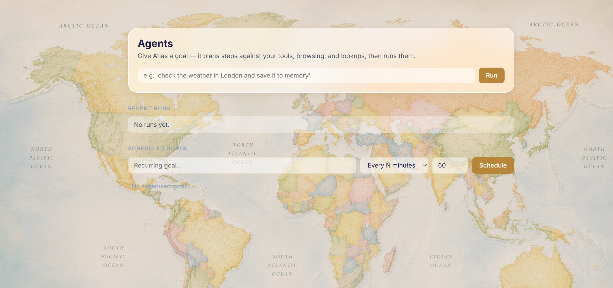

### 🧠 Memory
Every lookup, tool execution, and page visit is stored automatically in a two-tier memory system (SQLite + a ChromaDB semantic layer). Atlas periodically infers preferences from the pattern of what you search for, and injects relevant memory into tool-generation prompts silently — you never have to repeat context.

### 🔒 Privacy & safety, opt-in
- Tor proxy + fingerprint randomization for anonymous browsing (`tor=True`/`stealth=True` per request)
- Safe browsing check (Google Safe Browsing + VirusTotal + local phishing heuristics) that can 403 a dangerous URL before it's ever fetched
- Everything defaults **off** — Atlas doesn't route you through Tor or block URLs unless you've told it to, and those defaults live in one place (see Settings below)

### ⚙️ Settings & diagnostics
A single frosted-glass panel for the knobs that used to be env vars: prefer-free model routing, Tor/stealth/safe-browsing defaults, clearing memory, resetting the usage log, links out to every AI provider's own console, and live GPU/VRAM + provider-availability diagnostics.

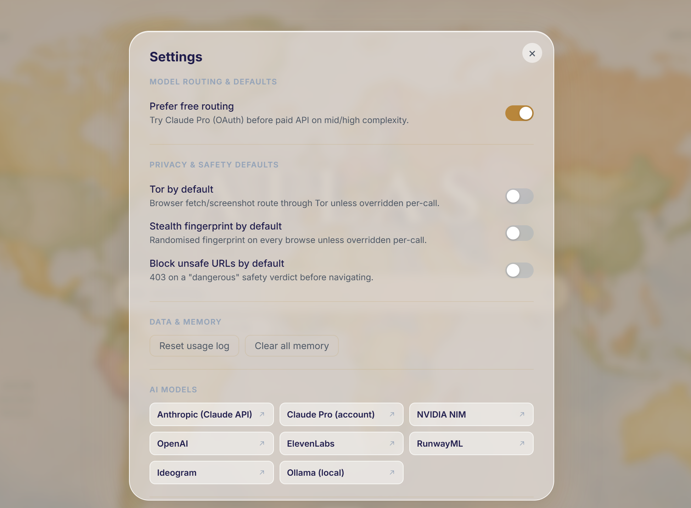

### 🧪 Dev mode
A hidden toggle unlocks a model picker (force any specific provider/model per request, for testing), a live cost/usage tracker, and a raw request log — all invisible in normal use.

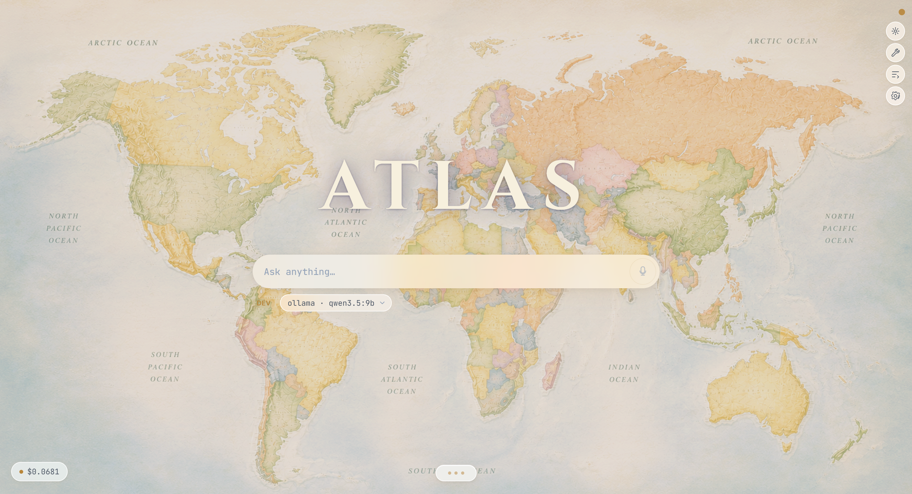
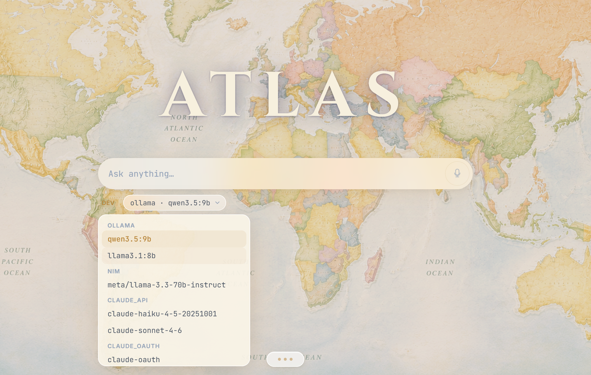
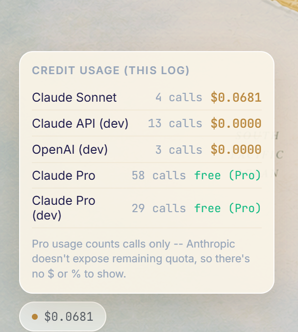
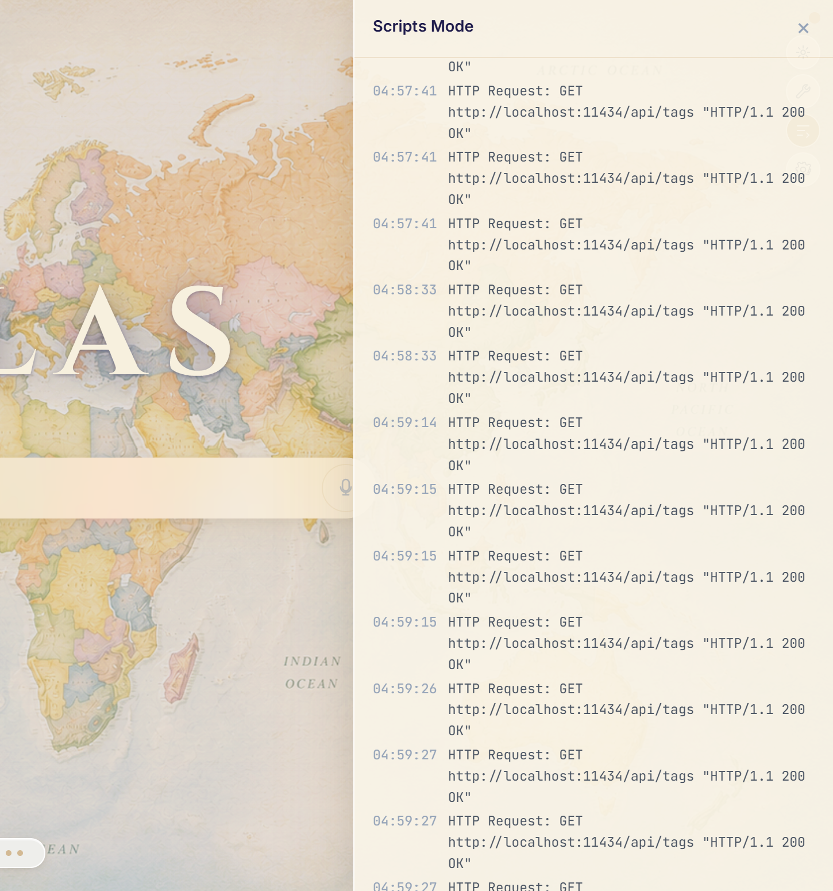

---

## APIs & models

Atlas doesn't lock you into one model provider — it routes between them based on task complexity, and prefers free/local whenever the task allows it:

| Tier | Provider | Used for |
|---|---|---|
| Embeddings | Ollama (`nomic-embed-text`, local) | Semantic memory search |
| Low complexity | NVIDIA NIM → Ollama (`llama3.1:8b`) fallback | Feasibility checks, classification, intent detection |
| High complexity | Claude Pro (OAuth, free) → Claude API (Sonnet/Haiku) fallback | Tool/code generation, goal decomposition |

Other integrations, all optional and degrade gracefully with no key configured:
- **Media**: FLUX (local, via ComfyUI), GPT Image, Ideogram, RunwayML (video), ElevenLabs (TTS)
- **Browsing**: Playwright (headless Chromium) for JS-rendered pages, form fill/extract, screenshots
- **Safety**: Google Safe Browsing v4, VirusTotal v3, plus a zero-dependency local phishing heuristic that works with no keys at all
- **Generated tools**: sandboxed access to `httpx`, `beautifulsoup4`, and Pillow only — nothing else is importable from inside a generated tool

---

## Standalone plans

Currently a local FastAPI + React app you run yourself. The roadmap's last phase is packaging:
- Windows installer + Start Menu shortcut (a basic version of this — `start.bat` + a shortcut script — already exists)
- Docker option for non-Windows / server use
- A setup wizard for API keys and model preferences
- Public GitHub release, once the tool-builder sandbox has had a real security pass (right now it's a *process* sandbox — subprocess isolation + a domain allowlist — not a hardened security boundary, and that's an explicit gap before this should run untrusted-generated code for anyone but its own developer)

A **v2 standalone browser** (not just a tool that calls out to Playwright, but an actual browser shell Atlas lives inside) has been flagged as a future direction, not yet scoped.

---

## Status

Actively developed, solo project, not yet packaged for distribution. Phases 1–10 of an 11-phase roadmap are built (model router, browser engine, memory, media generation, code sandbox, privacy layer, safe browsing, tool builder, agent loop, UI shell) — only packaging/distribution remains.
