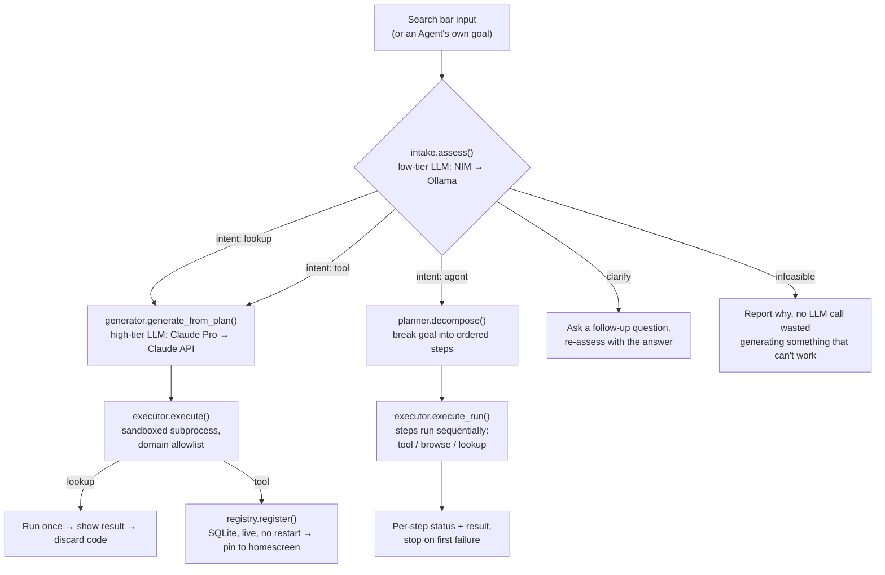
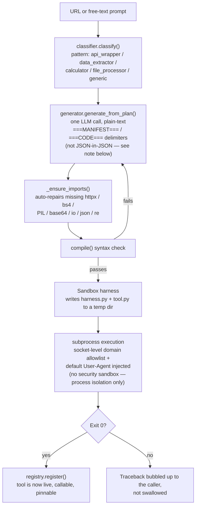

# Atlas

**The internet as a personal tool.** Not a browser you use — a platform that wields the internet for you.

One search bar. Ask a question, build a tool, generate media, kick off a multi-step agent, or browse privately — all from the same input, running local-first, backed by whichever AI model actually makes sense for the job.


> The Steve Jobs moment for the internet. One bar. Type what you want. Done.

---

## Why

Every "AI browser" so far is a chat window bolted onto a browser, or a browser with a chatbot sidebar. Atlas inverts that: the search bar *is* the interface, and everything else — tool creation, agents, memory, media — is something that bar can reach into on demand, without you ever having to know which subsystem is doing the work.

It's also **local-first by default**. Cheap, low-complexity work (classification, feasibility checks, embeddings) runs on your own GPU via Ollama. Only the parts that genuinely need a frontier model escalate to the cloud, and even then it tries your free Claude Pro subscription before spending API credits.

---

## What it can do today

### 🔍 Search that builds what it needs
Type a question and Atlas decides, per-request, what kind of answer it needs:
- **A direct lookup** ("who is Elon Musk") → generates a one-off Python tool on the spot, runs it, shows you a result card (with an image, key facts, related topics — Spotlight-style, not a wall of text), then throws the code away.
- **A reusable tool** ("build me a JPG to PNG converter") → generates and *saves* a tool with a real input form, pinned to your homescreen for next time.
- **A multi-step goal** ("check the weather in London and save it to memory") → detected automatically and handed to the agent planner instead of trying to force it into a single tool.


### 🛠️ Tool Builder — the core idea
Paste a URL or describe what you want, and an LLM classifies the page/request, writes a manifest + Python implementation, and registers it live — no restart, no deploy step. Every generated tool runs in a sandboxed subprocess with a socket-level domain allowlist (it can only talk to the domains it declared upfront).


Pinned tools live in a slide-up "Notch" at the bottom of the screen. Tapping one opens a real input form in a modal — not a blind re-run with default values.


### 🤖 Agents
Give it a goal instead of a question. It decomposes the goal into ordered steps (run a saved tool / browse a URL / do a one-off lookup), executes them in sequence, and shows you exactly which step failed if something breaks. Recurring goals can be scheduled (every N minutes, or daily at a fixed time) and run unattended in the background.


### 🧠 Memory
Every lookup, tool execution, and page visit is stored automatically in a two-tier memory system (SQLite + a ChromaDB semantic layer). Atlas periodically infers preferences from the pattern of what you search for, and injects relevant memory into tool-generation prompts silently — you never have to repeat context.

### 🔒 Privacy & safety, opt-in
- Tor proxy + fingerprint randomization for anonymous browsing (`tor=True`/`stealth=True` per request)
- Safe browsing check (Google Safe Browsing + VirusTotal + local phishing heuristics) that can 403 a dangerous URL before it's ever fetched
- Everything defaults **off** — Atlas doesn't route you through Tor or block URLs unless you've told it to, and those defaults live in one place (see Settings below)

### ⚙️ Settings & diagnostics
A single frosted-glass panel for the knobs that used to be env vars: prefer-free model routing, Tor/stealth/safe-browsing defaults, clearing memory, resetting the usage log, links out to every AI provider's own console, and live GPU/VRAM + provider-availability diagnostics.


### 🧪 Dev mode
A hidden toggle unlocks a model picker (force any specific provider/model per request, for testing), a live cost/usage tracker, and a raw request log — all invisible in normal use.


---

## Architecture

### Request flow



### Tool Builder — how a page or a sentence becomes running code



The tool builder doesn't edit *its own* source — it writes brand-new, throwaway or saved Python files per request. Nothing it generates can modify Atlas's own backend/frontend code; the sandbox's domain allowlist and subprocess isolation exist specifically so generated code can't reach outside the one job it was written for.

> **Why plain-text delimiters instead of JSON?** An earlier version had the LLM return `{"manifest": {...}, "code": "..."}` as one JSON blob, with the Python source embedded as a JSON string value. Weaker local models routinely broke this — unescaped backslashes/quotes inside the embedded code corrupted the JSON. Switching to `===MANIFEST===` / `===CODE===` plain-text sections removed the entire bug class instead of patching individual escape failures.

### Project structure

```
atlas/
├── backend/
│   ├── app/
│   │   ├── models/        # Phase 1 — router.py + one client per provider
│   │   │   ├── router.py
│   │   │   ├── ollama_client.py
│   │   │   ├── nim_client.py
│   │   │   ├── claude_api_client.py
│   │   │   ├── claude_oauth_client.py
│   │   │   └── usage_log.py
│   │   ├── browser/        # Phase 2 — Playwright engine
│   │   ├── search/         # Phase 3 — ChromaDB + BM25
│   │   ├── media/          # Phase 4 — FLUX/GPT Image/Ideogram/RunwayML/ElevenLabs
│   │   ├── ide/             # Phase 5 — sandbox runner, git ops, AI completion
│   │   ├── privacy/        # Phase 6 — Tor proxy, fingerprint spoofing
│   │   ├── safety/          # Phase 7 — Safe Browsing, VirusTotal, heuristics
│   │   ├── toolbuilder/    # Phase 8 — classifier, generator, executor, registry
│   │   ├── memory/         # Phase 9 — SQLite + ChromaDB two-tier store
│   │   ├── agents/          # Phase 10 — store, planner, executor, scheduler
│   │   ├── dev/              # Dev-mode: settings_store, diagnostics, activity_log
│   │   └── api/               # FastAPI routes + Pydantic schemas
│   └── venv/
├── frontend/
│   └── src/
│       ├── App.jsx            # Shell: nav state, dev-mode toggle, overlay coordination
│       ├── pages/            # HomePage, ToolBuilderPage, AgentsPage, BrowserPage
│       └── components/     # Notch, ScriptsPanel, SettingsPanel, UsageWidget, ToolPanel
├── data/                       # usage_log.jsonl, settings.json, memory.db, agents.db
├── docs/                       # This README + screenshots
└── start.bat                  # One-click launcher (backend + frontend)
```

## APIs & models

Atlas doesn't lock you into one model provider — it routes between them based on task complexity, and prefers free/local whenever the task allows it.

### Routing tiers

| Tier | Provider (in fallback order) | Used for |
|---|---|---|
| Embeddings | Ollama (`nomic-embed-text`, local) | Semantic memory search |
| Low complexity | NVIDIA NIM &rarr; Ollama (`llama3.1:8b`) | Feasibility checks, classification, intent detection |
| High complexity | Claude Pro (OAuth, free) &rarr; Claude API | Tool/code generation, goal decomposition |

### Every model currently wired up (dev-mode model picker)

| Provider | Models |
|---|---|
| Ollama (local) | `llama3.1:8b` (default), `qwen3.5:9b` (opt-in — defaults into a thinking-mode spiral, not used as a router default) |
| NVIDIA NIM | `meta/llama-3.3-70b-instruct` |
| Claude API | `claude-haiku-4-5`, `claude-sonnet-4-6` |
| Claude Pro (OAuth) | `claude-oauth` (routes to whatever model the Pro subscription serves via Claude Code) |

### Other API integrations

All optional, all degrade gracefully with no key configured:

| Category | Provider | Notes |
|---|---|---|
| Image generation | FLUX (local, via ComfyUI) | Runs entirely on-device, no API cost |
| Image generation | GPT Image (OpenAI) | Cloud, replaces an earlier DALL-E 3 integration after OpenAI deprecated it |
| Image generation | Ideogram | Cloud |
| Video generation | RunwayML (`gen4_turbo`) | Cloud |
| Voice | ElevenLabs (TTS) | Cloud |
| Browsing | Playwright (headless Chromium) | JS-rendered pages, form fill/extract, screenshots |
| Privacy | Tor (SOCKS5 proxy) | Opt-in per request, off by default |
| Safety | Google Safe Browsing v4 | Falls back to local heuristics with no key |
| Safety | VirusTotal v3 | Falls back to local heuristics with no key |
| Reference data | Wikipedia REST API (`summary`, `media-list`, `search/page`) | Used *inside* generated lookup tools, not by Atlas's own backend directly |

Generated tools themselves are restricted to `httpx`, `beautifulsoup4`, and Pillow — nothing else is importable from inside sandboxed code, regardless of what the model tries to write.


---

## Standalone plans

Currently a local FastAPI + React app you run yourself. The roadmap's last phase is packaging:
- Windows installer + Start Menu shortcut (a basic version of this — `start.bat` + a shortcut script — already exists)
- Docker option for non-Windows / server use
- A setup wizard for API keys and model preferences
- Public GitHub release, once the tool-builder sandbox has had a real security pass (right now it's a *process* sandbox — subprocess isolation + a domain allowlist — not a hardened security boundary, and that's an explicit gap before this should run untrusted-generated code for anyone but its own developer)

A **v2 standalone browser** (not just a tool that calls out to Playwright, but an actual browser shell Atlas lives inside) has been flagged as a future direction, not yet scoped.

---

## Status

Actively developed, solo project, not yet packaged for distribution. Phases 1–10 of an 11-phase roadmap are built (model router, browser engine, memory, media generation, code sandbox, privacy layer, safe browsing, tool builder, agent loop, UI shell) — only packaging/distribution remains.

---

## Planned: command shortcuts (not yet live)

An earlier UI pass added prefix commands to the search bar for jumping straight to a subsystem:

| Prefix | Target |
|---|---|
| `~` | Tool Builder |
| `#` | Memory |
| `*` | Run a saved tool |
| `/` | Browser |
| `>` | Code IDE |

These were pulled out when the AI intent pipeline (lookup/tool/agent detection) took over routing search-bar input — right now typing `~something` is just treated as ordinary search text, not a shortcut. Listed here as a planned re-add, not a current feature.
